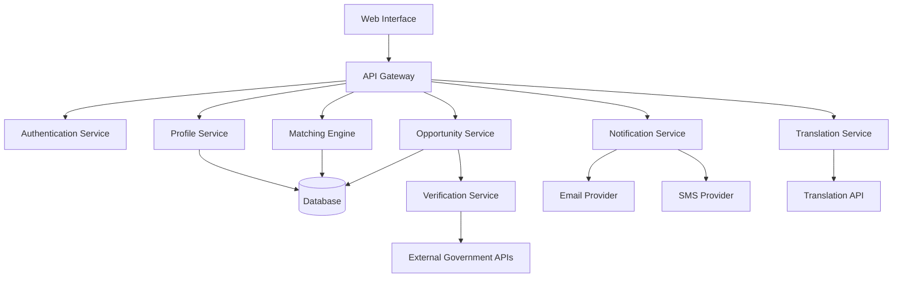

# Design Document: Student Opportunity Navigator

## Overview

The Student Opportunity Navigator is a web-based platform that connects students with government exams and scholarships through intelligent profile matching. The system consists of three primary layers:

1. **Data Layer**: Manages student profiles, opportunity catalog, and verification metadata
2. **Matching Engine**: Implements eligibility logic to filter opportunities based on student profiles
3. **Presentation Layer**: Provides multilingual UI, search capabilities, and notification delivery

The architecture emphasizes data accuracy, real-time filtering, and accessibility across diverse linguistic and socioeconomic backgrounds.

## Architecture

### System Components



### Component Responsibilities

- **API Gateway**: Routes requests, handles rate limiting, and enforces authentication
- **Authentication Service**: Manages user sessions, login, and access control
- **Profile Service**: CRUD operations for student profiles with validation
- **Matching Engine**: Evaluates eligibility criteria against student profiles
- **Opportunity Service**: Manages opportunity catalog, deadlines, and metadata
- **Verification Service**: Validates opportunities against official sources
- **Notification Service**: Sends alerts for new opportunities and deadline reminders
- **Translation Service**: Translates guidelines into multiple languages

## Components and Interfaces

### Profile Service

**Responsibilities:**
- Create, read, update, delete student profiles
- Validate profile data against constraints
- Trigger matching engine when profile changes

**Interface:**
```
createProfile(studentData: StudentProfile) -> ProfileID
updateProfile(profileID: ProfileID, updates: Partial<StudentProfile>) -> Result
getProfile(profileID: ProfileID) -> StudentProfile
deleteProfile(profileID: ProfileID) -> Result
validateProfile(studentData: StudentProfile) -> ValidationResult
```

**Validation Rules:**
- Age: Must be between 10 and 100
- Location: Must be a valid state/city in India
- Education: Must be one of predefined levels
- Income: Must be a non-negative number
- Category: Must be one of General, OBC, SC, ST, EWS, or other recognized categories

### Matching Engine

**Responsibilities:**
- Evaluate student eligibility for opportunities
- Filter opportunity lists based on profile criteria
- Explain eligibility decisions

**Interface:**
```
matchOpportunities(profileID: ProfileID) -> List<OpportunityMatch>
checkEligibility(profileID: ProfileID, opportunityID: OpportunityID) -> EligibilityResult
explainEligibility(profileID: ProfileID, opportunityID: OpportunityID) -> EligibilityExplanation
```

**Matching Algorithm:**
1. Retrieve student profile
2. Retrieve all active opportunities
3. For each opportunity:
   - Evaluate age criteria (min/max age, age as of specific date)
   - Evaluate location criteria (state, district, or nationwide)
   - Evaluate education criteria (minimum level, specific degrees)
   - Evaluate income criteria (maximum annual income)
   - Evaluate category criteria (reserved categories, open to all)
4. Include opportunity only if ALL criteria are satisfied
5. Rank by deadline proximity and relevance

### Opportunity Service

**Responsibilities:**
- Store and retrieve opportunity details
- Manage deadlines and expiration
- Coordinate with verification service

**Interface:**
```
createOpportunity(opportunityData: Opportunity) -> OpportunityID
updateOpportunity(opportunityID: OpportunityID, updates: Partial<Opportunity>) -> Result
getOpportunity(opportunityID: OpportunityID) -> Opportunity
listActiveOpportunities() -> List<Opportunity>
searchOpportunities(query: SearchQuery) -> List<Opportunity>
expireOpportunity(opportunityID: OpportunityID) -> Result
```

**Deadline Management:**
- Background job runs every hour to check for expired deadlines
- Opportunities with passed deadlines are marked as expired
- Expired opportunities are excluded from active listings

### Verification Service

**Responsibilities:**
- Validate opportunities against official government sources
- Maintain verification status and audit trail
- Refresh opportunity data periodically

**Interface:**
```
verifyOpportunity(opportunityID: OpportunityID) -> VerificationResult
refreshOpportunityData(opportunityID: OpportunityID) -> Result
getVerificationStatus(opportunityID: OpportunityID) -> VerificationStatus
scheduleVerification(opportunityID: OpportunityID, interval: Duration) -> Result
```

**Verification Process:**
1. Extract official source URL from opportunity metadata
2. Fetch current data from official website or API
3. Compare fetched data with stored data
4. Flag discrepancies for manual review
5. Update verification timestamp and status
6. Schedule next verification check

### Translation Service

**Responsibilities:**
- Translate opportunity guidelines into supported languages
- Cache translations for performance
- Handle translation failures gracefully

**Interface:**
```
translateGuideline(text: String, targetLanguage: Language) -> TranslatedText
getSupportedLanguages() -> List<Language>
cacheTranslation(originalText: String, language: Language, translation: String) -> Result
```

**Supported Languages:**
- English (default)
- Hindi, Bengali, Tamil, Telugu, Marathi, Gujarati, Kannada, Malayalam, Punjabi, Urdu

**Translation Strategy:**
- Use external translation API (e.g., Google Translate API, Azure Translator)
- Cache translations in database to reduce API calls
- Fall back to original text if translation fails
- Preserve formatting and structure in translations

### Notification Service

**Responsibilities:**
- Send notifications for new opportunities and deadline reminders
- Manage notification preferences
- Track notification delivery status

**Interface:**
```
sendNotification(profileID: ProfileID, notification: Notification) -> Result
scheduleReminder(profileID: ProfileID, opportunityID: OpportunityID, reminderDate: DateTime) -> Result
updatePreferences(profileID: ProfileID, preferences: NotificationPreferences) -> Result
getNotificationHistory(profileID: ProfileID) -> List<Notification>
```

**Notification Types:**
- New opportunity match
- 7-day deadline reminder
- 24-hour deadline reminder

**Notification Channels:**
- Email (primary)
- SMS (optional, based on preferences)
- In-app notifications

## Data Models

### StudentProfile

```
StudentProfile {
  profileID: UUID
  userID: UUID
  age: Integer
  dateOfBirth: Date
  state: String
  district: String
  educationLevel: EducationLevel
  currentDegree: String (optional)
  annualIncome: Decimal
  category: Category
  languagePreference: Language
  createdAt: DateTime
  updatedAt: DateTime
}

EducationLevel: Enum {
  HIGH_SCHOOL,
  UNDERGRADUATE,
  POSTGRADUATE,
  DOCTORAL
}

Category: Enum {
  GENERAL,
  OBC,
  SC,
  ST,
  EWS,
  OTHER
}
```

### Opportunity

```
Opportunity {
  opportunityID: UUID
  name: String
  type: OpportunityType
  organization: String
  description: String
  guidelines: String
  eligibilityCriteria: EligibilityCriteria
  registrationLink: URL
  deadline: DateTime
  verificationStatus: VerificationStatus
  verifiedAt: DateTime
  sourceURL: URL
  benefits: String (optional, for scholarships)
  syllabus: String (optional, for exams)
  examPattern: String (optional, for exams)
  awardAmount: Decimal (optional, for scholarships)
  createdAt: DateTime
  updatedAt: DateTime
}

OpportunityType: Enum {
  EXAM,
  SCHOLARSHIP
}

VerificationStatus: Enum {
  VERIFIED,
  PENDING,
  FAILED,
  EXPIRED
}
```

### EligibilityCriteria

```
EligibilityCriteria {
  minAge: Integer (optional)
  maxAge: Integer (optional)
  ageAsOfDate: Date (optional)
  states: List<String> (optional, empty means nationwide)
  districts: List<String> (optional)
  minEducationLevel: EducationLevel
  requiredDegrees: List<String> (optional)
  maxIncome: Decimal (optional)
  eligibleCategories: List<Category> (optional, empty means all)
  additionalCriteria: Map<String, String> (optional)
}
```

### OpportunityMatch

```
OpportunityMatch {
  opportunity: Opportunity
  eligibilityStatus: EligibilityStatus
  matchedCriteria: List<String>
  unmatchedCriteria: List<String>
  relevanceScore: Float
}

EligibilityStatus: Enum {
  ELIGIBLE,
  NOT_ELIGIBLE,
  PARTIALLY_ELIGIBLE
}
```

### EligibilityExplanation

```
EligibilityExplanation {
  opportunityID: UUID
  profileID: UUID
  overallStatus: EligibilityStatus
  criteriaEvaluations: List<CriteriaEvaluation>
  generatedAt: DateTime
}

CriteriaEvaluation {
  criterionName: String
  required: String
  studentValue: String
  satisfied: Boolean
  explanation: String
}
```

### Notification

```
Notification {
  notificationID: UUID
  profileID: UUID
  opportunityID: UUID (optional)
  type: NotificationType
  title: String
  message: String
  link: URL (optional)
  sentAt: DateTime
  deliveryStatus: DeliveryStatus
  channel: NotificationChannel
}

NotificationType: Enum {
  NEW_OPPORTUNITY,
  DEADLINE_REMINDER_7_DAYS,
  DEADLINE_REMINDER_24_HOURS
}

DeliveryStatus: Enum {
  PENDING,
  SENT,
  FAILED,
  READ
}

NotificationChannel: Enum {
  EMAIL,
  SMS,
  IN_APP
}
```


## Correctness Properties

A property is a characteristic or behavior that should hold true across all valid executions of a system—essentially, a formal statement about what the system should do. Properties serve as the bridge between human-readable specifications and machine-verifiable correctness guarantees.

### Property 1: Profile Data Round-Trip

*For any* valid student profile data, creating a profile and then retrieving it should return equivalent data with all fields (age, location, education, income, category) preserved.

**Validates: Requirements 1.1, 1.3**

### Property 2: Profile Validation Enforcement

*For any* profile update that violates defined constraints (invalid age range, invalid location, invalid education level, negative income, invalid category), the system should reject the update and return a descriptive error message.

**Validates: Requirements 1.2, 1.4**

### Property 3: Opportunity Filtering Completeness

*For any* student profile and set of opportunities, all returned opportunities should satisfy ALL eligibility criteria (age, location, education, income, category) for that profile, and no eligible opportunities should be excluded.

**Validates: Requirements 2.1, 2.2, 2.3**

### Property 4: Profile Change Triggers Re-Matching

*For any* student profile, when profile data is updated, the filtered opportunity list should be recalculated to reflect the new eligibility status.

**Validates: Requirements 2.5**

### Property 5: Eligibility Explanation Completeness

*For any* student profile and opportunity, the eligibility explanation should include the overall status (eligible/not eligible) and the evaluation result for each individual criterion (age, location, education, income, category) with satisfied/unsatisfied indicators.

**Validates: Requirements 3.1, 3.2, 3.3, 3.5**

### Property 6: Threshold Proximity Highlighting

*For any* student profile and opportunity where the student's value is within 10% of an eligibility threshold (e.g., age within 1 year of max age, income within 10% of max income), the system should highlight that criterion as marginally eligible.

**Validates: Requirements 3.4**

### Property 7: Language Preference Application

*For any* student with a language preference set, all opportunity guidelines displayed to that student should be in the selected language (or original text if translation unavailable).

**Validates: Requirements 4.2, 4.5**

### Property 8: Opportunity Display Required Fields

*For any* opportunity displayed to a student, the display should include registration link, deadline with date and time, verification status, and source information.

**Validates: Requirements 5.1, 5.2, 6.2**

### Property 9: Deadline-Based Highlighting

*For any* opportunity with a deadline within 7 days from the current date, the system should apply a visual highlight indicator when displaying that opportunity.

**Validates: Requirements 5.3**

### Property 10: Expired Opportunity Exclusion

*For any* opportunity with a deadline in the past, the system should exclude it from active opportunity listings or mark it as expired.

**Validates: Requirements 5.4**

### Property 11: Unverified Opportunity Exclusion

*For any* opportunity with verification status of FAILED or PENDING, the system should exclude it from student-facing opportunity listings.

**Validates: Requirements 6.4**

### Property 12: Verification Audit Trail

*For any* verification check performed on an opportunity, the system should create an audit record containing the verification timestamp, status, and source URL.

**Validates: Requirements 6.5**

### Property 13: Search Field Filtering

*For any* search query specifying opportunity name, organization, exam type, or scholarship category, all returned results should match the specified search criteria.

**Validates: Requirements 7.1**

### Property 14: Search Result Ranking

*For any* search query, results should be ordered by a combination of relevance score and deadline proximity, with higher relevance and closer deadlines appearing first.

**Validates: Requirements 7.2**

### Property 15: Filter Application

*For any* combination of filters (opportunity type, education level, location), all returned results should satisfy all applied filters.

**Validates: Requirements 7.3**

### Property 16: Search Result Eligibility Indication

*For any* search result displayed to a student, each opportunity should include an eligibility status indicator (eligible/not eligible/partially eligible) based on the student's profile.

**Validates: Requirements 7.4**

### Property 17: Sort Order Correctness

*For any* sort option selected (deadline, relevance, alphabetical), the results should be ordered according to that criterion in the correct direction (ascending for deadlines and alphabetical, descending for relevance).

**Validates: Requirements 7.5**

### Property 18: Deadline Reminder Scheduling

*For any* opportunity with a deadline exactly 7 days away or exactly 24 hours away, the system should schedule a reminder notification for students who are eligible for that opportunity.

**Validates: Requirements 8.2, 8.3**

### Property 19: Notification Preference Respect

*For any* student with notification preferences configured, notifications should only be sent through the enabled channels and at the configured frequency.

**Validates: Requirements 8.4**

### Property 20: Notification Content Completeness

*For any* notification sent to a student, the notification should include the opportunity name, deadline, and a direct link to the opportunity details.

**Validates: Requirements 8.5**

### Property 21: Account Deletion Data Removal

*For any* student account that is deleted, all associated personal profile data should be permanently removed from the system.

**Validates: Requirements 9.3**

### Property 22: Opportunity Detail Completeness

*For any* opportunity displayed in detail view, the display should include description, benefits, selection process, and downloadable documentation links.

**Validates: Requirements 10.1, 10.4**

### Property 23: Exam-Specific Field Display

*For any* opportunity of type EXAM, the detail display should include syllabus information, exam pattern, and preparation resources.

**Validates: Requirements 10.2**

### Property 24: Scholarship-Specific Field Display

*For any* opportunity of type SCHOLARSHIP, the detail display should include award amount, duration, and disbursement details.

**Validates: Requirements 10.3**

## Error Handling

### Profile Service Errors

- **Invalid Input**: Return 400 Bad Request with specific validation errors
- **Profile Not Found**: Return 404 Not Found
- **Duplicate Profile**: Return 409 Conflict
- **Database Errors**: Return 500 Internal Server Error, log error details

### Matching Engine Errors

- **Profile Not Found**: Return empty match list with explanation
- **Invalid Criteria**: Log warning, skip invalid criteria, continue matching
- **Database Errors**: Return 500 Internal Server Error, log error details

### Opportunity Service Errors

- **Opportunity Not Found**: Return 404 Not Found
- **Invalid Search Query**: Return 400 Bad Request with query validation errors
- **Database Errors**: Return 500 Internal Server Error, log error details

### Verification Service Errors

- **Source Unreachable**: Mark verification as FAILED, schedule retry
- **Data Mismatch**: Flag for manual review, maintain current data
- **Invalid Source URL**: Mark verification as FAILED, alert administrators

### Translation Service Errors

- **Translation API Failure**: Fall back to original text, log error
- **Unsupported Language**: Return original text with notification
- **Rate Limit Exceeded**: Use cached translations, queue new requests

### Notification Service Errors

- **Delivery Failure**: Mark notification as FAILED, schedule retry (max 3 attempts)
- **Invalid Contact Info**: Log error, skip notification
- **Rate Limit Exceeded**: Queue notifications for later delivery

### General Error Handling Principles

1. **Fail Gracefully**: Never expose internal errors to users
2. **Log Everything**: Maintain detailed logs for debugging
3. **Retry Transient Failures**: Implement exponential backoff for network errors
4. **Alert on Critical Failures**: Notify administrators of system-wide issues
5. **Maintain Data Integrity**: Use transactions for multi-step operations

## Testing Strategy

### Dual Testing Approach

The system will employ both unit testing and property-based testing to ensure comprehensive coverage:

- **Unit tests**: Verify specific examples, edge cases, and error conditions
- **Property tests**: Verify universal properties across all inputs

Both approaches are complementary and necessary. Unit tests catch concrete bugs and validate specific scenarios, while property tests verify general correctness across a wide range of inputs.

### Property-Based Testing Configuration

**Library Selection:**
- **Python**: Use Hypothesis library
- **TypeScript/JavaScript**: Use fast-check library
- **Java**: Use jqwik library

**Test Configuration:**
- Each property test must run a minimum of 100 iterations
- Each test must be tagged with a comment referencing the design property
- Tag format: `# Feature: student-opportunity-navigator, Property N: [property text]`
- Each correctness property must be implemented by a single property-based test

**Example Property Test (Python with Hypothesis):**

```python
from hypothesis import given, strategies as st
import pytest

# Feature: student-opportunity-navigator, Property 1: Profile Data Round-Trip
@given(st.builds(
    StudentProfile,
    age=st.integers(min_value=10, max_value=100),
    state=st.sampled_from(VALID_STATES),
    educationLevel=st.sampled_from(EducationLevel),
    annualIncome=st.decimals(min_value=0, max_value=10000000),
    category=st.sampled_from(Category)
))
def test_profile_round_trip(profile_data):
    # Create profile
    profile_id = profile_service.create_profile(profile_data)
    
    # Retrieve profile
    retrieved = profile_service.get_profile(profile_id)
    
    # Assert equivalence
    assert retrieved.age == profile_data.age
    assert retrieved.state == profile_data.state
    assert retrieved.educationLevel == profile_data.educationLevel
    assert retrieved.annualIncome == profile_data.annualIncome
    assert retrieved.category == profile_data.category
```

### Unit Testing Strategy

**Focus Areas:**
- Specific examples demonstrating correct behavior
- Edge cases (empty lists, boundary values, null handling)
- Error conditions (invalid inputs, missing data, network failures)
- Integration points between components

**Unit Test Balance:**
- Avoid writing too many unit tests for scenarios covered by property tests
- Focus unit tests on concrete examples and integration scenarios
- Use unit tests to validate error messages and specific error handling paths

**Example Unit Test:**

```python
def test_profile_creation_with_missing_required_field():
    # Missing age field
    incomplete_data = {
        'state': 'Maharashtra',
        'educationLevel': EducationLevel.UNDERGRADUATE,
        'annualIncome': 500000,
        'category': Category.GENERAL
    }
    
    with pytest.raises(ValidationError) as exc_info:
        profile_service.create_profile(incomplete_data)
    
    assert 'age' in str(exc_info.value)
    assert 'required' in str(exc_info.value).lower()
```

### Integration Testing

**Scope:**
- End-to-end flows (profile creation → matching → notification)
- External service integration (translation API, notification providers)
- Database operations and transactions
- Authentication and authorization flows

### Performance Testing

**Key Metrics:**
- Profile matching latency (target: < 200ms for 10,000 opportunities)
- Search response time (target: < 500ms)
- Notification delivery time (target: < 5 seconds)
- Database query performance (target: < 100ms for most queries)

### Security Testing

**Focus Areas:**
- Authentication bypass attempts
- Authorization violations
- SQL injection and XSS vulnerabilities
- Data encryption verification
- Rate limiting effectiveness
